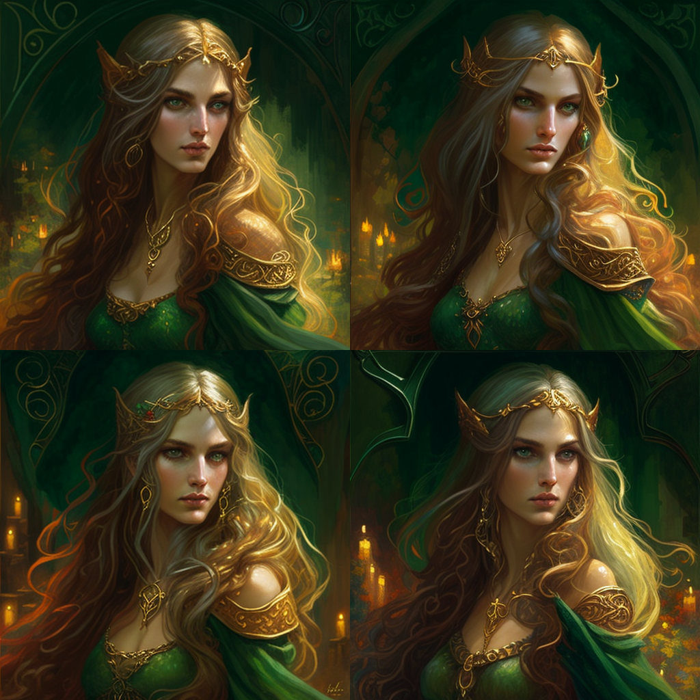

# AI generated TTRPG character

On: 2023-03-27

This is a little experiment at generating a full character for Changeling: The Dreaming from AI tools.

## ChatGPT-4

Let's first check if we can come up with some character material from [OpenAI](https://chat.openai.com/).

### Background

> Hi ! Are you able to come up with a random character background for the tabletop roleplaying game Changeling : The Dreaming (second edition) ? If so, please show me.

```txt
Sure, I'd be happy to help! Here's a random character background for Changeling: The Dreaming (second edition):

Name: Gwyneth "Gwen" Davies

Kith: Sidhe

Seeming: Wilder

Court: Seelie

Background:

Gwen was born in a small Welsh village to a family with a long line of noble ancestry. From a young age, she displayed an otherworldly beauty and an air of regality that left those around her in awe. Her family always knew she was different, but they could never quite put their finger on what it was.

As she grew older, Gwen's supernatural abilities began to manifest. She could control the elements with a mere thought, and her eyes would sometimes glow with an ethereal light. Her family was frightened by these strange occurrences and sought to keep her hidden away from prying eyes.

One day, while wandering through the nearby woods, Gwen stumbled upon a hidden faerie ring. As she stepped into the center of the circle, she was suddenly transported to the land of the fae. There, she discovered that she was not human at all, but rather a Sidhe, one of the powerful faerie nobles.

Gwen spent many years in the realm of the fae, honing her abilities and learning the ways of her kind. Eventually, she grew restless and decided to return to the mortal world. Now, she walks among humans, using her beauty and charm to navigate the complexities of human society. However, she never forgets her true nature and is always on the lookout for other fae who might cross her path.

Personality:

Gwen is proud and haughty, as befits her noble lineage. She has a quick wit and a sharp tongue, and is not afraid to speak her mind. However, she also has a kind heart and is fiercely loyal to those she considers her friends. She can be somewhat naive when it comes to human customs, but she is eager to learn and always curious about the world around her.
```

### Description

Let's have OpenAI imagine Gwen's appearance through its former provided background.

> Could you describe me physically how Gwyneth "Gwen" Davies (the character you've just created) looks like ?

```txt
Certainly! Here's a physical description of Gwyneth "Gwen" Davies:

Gwen is a stunningly beautiful woman with long, flowing hair the color of burnished gold. Her eyes are a deep shade of emerald green, and they seem to sparkle with an inner light. She stands at an impressive 5'10" and has a slender, athletic build. Her features are sharp and regal, with high cheekbones, a straight nose, and full lips. She carries herself with an air of confidence and poise, as though she were born to rule.

Gwen favors clothing that is both elegant and practical. She often wears flowing dresses made of natural fabrics like silk and cotton, which allow her to move freely while also accentuating her graceful movements. She is also fond of accessorizing with intricate jewelry, such as delicate necklaces and bracelets made of gold or silver, which serve to highlight her beauty and add to her air of nobility.
```

### Image

> Could you come up with an image depicting Gwyneth "Gwen" Davies (the character you've just created) ?

```txt
As an AI language model, I don't have the capability to create images, but I can certainly provide a description that can serve as inspiration for an artist to create an image of Gwyneth "Gwen" Davies. Here is a possible description:

The image depicts Gwyneth "Gwen" Davies standing in a field of wildflowers, her long hair flowing in the breeze. She is wearing a flowing, green silk dress that falls to her ankles, with a silver chain around her neck. Her arms are outstretched, and in her right hand, she holds a glowing orb of light that illuminates her face. Her expression is one of serene beauty, as though she is lost in thought or communing with the natural world around her. The background is filled with the vibrant colors of the wildflowers, and the sky above is a deep shade of blue, with wispy clouds drifting across it.
```

### Character sheet

> Are you able to generate the character sheet for Gwyneth "Gwen" Davies (the character you've just created) for Changeling : The Dreaming (second edition) ?

```txt
Certainly! Here's a character sheet for Gwyneth "Gwen" Davies in Changeling: The Dreaming (second edition):

Name: Gwyneth "Gwen" Davies

Player:

Chronicle:

Seeming: Wilder

Kith: Sidhe

Court: Seelie

Attributes:

Physical: Strength 2, Dexterity 3, Stamina 2

Social: Charisma 4, Manipulation 3, Appearance 4

Mental: Perception 3, Intelligence 2, Wits 3

Abilities:

Talents: Alertness 2, Athletics 2, Brawl 1, Empathy 2, Expression 3, Intimidation 1, Leadership 2, Streetwise 1, Subterfuge 2

Skills: Animal Ken 1, Crafts 1, Etiquette 3, Firearms 1, Melee 2, Performance 2, Stealth 2, Survival 1

Knowledges: Enigmas 2, Investigation 2, Law 1, Linguistics 2 (Welsh, English), Occult 2, Politics 1

Backgrounds:

Title 3, Resources 2, Retainers 1, Changeling Kinfolk 1

Merits and Flaws:

Glamour Addict (-2), Unearthly Beauty (3)

Virtues:

Conscience 3, Self-Control 3, Courage 3

Humanity:

Willpower 6

Banality:

Permanent 5, Temporary 1

Birthright:

Wyrd 3

Arts:

Primal 2, Sovereign 1, Wayfare 2

Realms:

Actor 2, Nature 2, Scene 2, Time 1

Equipment:

Gwen possesses a variety of elegant clothing suitable for different occasions, as well as a few pieces of fine jewelry. She also owns a small cottage on the outskirts of a Welsh village, which serves as a retreat and a place of solitude when she needs to recharge her glamour.

Description:

Gwyneth "Gwen" Davies is a proud and haughty Sidhe noble, possessing supernatural beauty and otherworldly abilities. She is fiercely loyal to her friends and allies, and is always on the lookout for other fae who might cross her path. Though she can be naive when it comes to human customs, she is eager to learn and always curious about the world around her. She favors clothing that is both elegant and practical, and is often seen wearing flowing dresses made of natural fabrics like silk and cotton, which allow her to move freely while also accentuating her graceful movements. She carries herself with an air of confidence and poise, as though she were born to rule.
```

It's not perfect (character sheet contains erronous characteristics, but most are OK), but let's see if it can be formatted too (which ultimately would be required to create an online character generator and be able to ingest the generated data)

> Could you format the character sheet you've just created as YAML ?

```yaml
Name: "Gwyneth 'Gwen' Davies"
Player: 
Chronicle: 
Seeming: "Wilder"
Kith: "Sidhe"
Court: "Seelie"

Attributes:
  Physical: 
    Strength: 2
    Dexterity: 3
    Stamina: 2
  Social: 
    Charisma: 4
    Manipulation: 3
    Appearance: 4
  Mental: 
    Perception: 3
    Intelligence: 2
    Wits: 3

Abilities:
  Talents: 
    Alertness: 2
    Athletics: 2
    Brawl: 1
    Empathy: 2
    Expression: 3
    Intimidation: 1
    Leadership: 2
    Streetwise: 1
    Subterfuge: 2
  Skills: 
    Animal Ken: 1
    Crafts: 1
    Etiquette: 3
    Firearms: 1
    Melee: 2
    Performance: 2
    Stealth: 2
    Survival: 1
  Knowledges: 
    Enigmas: 2
    Investigation: 2
    Law: 1
    Linguistics: 2
      Welsh
      English
    Occult: 2
    Politics: 1

Backgrounds:
  Title: 3
  Resources: 2
  Retainers: 1
  Changeling Kinfolk: 1

Merits and Flaws:
  Glamour Addict: -2
  Unearthly Beauty: 3

Virtues:
  Conscience: 3
  Self-Control: 3
  Courage: 3

Humanity:
  Willpower: 6

Banality:
  Permanent: 5
  Temporary: 1

Birthright:
  Wyrd: 3

Arts:
  Primal: 2
  Sovereign: 1
  Wayfare: 2

Realms:
  Actor: 2
  Nature: 2
  Scene: 2
  Time: 1

Equipment: |
  Gwyneth possesses a variety of elegant clothing suitable for different occasions, as well as a few pieces of fine jewelry. She also owns a small cottage on the outskirts of a Welsh village, which serves as a retreat and a place of solitude when she needs to recharge her glamour.

Description: |
  Gwyneth "Gwen" Davies is a proud and haughty Sidhe noble, possessing supernatural beauty and otherworldly abilities. She is fiercely loyal to her friends and allies, and is always on the lookout for other fae who might cross her path. Though she can be naive when it comes to human customs, she is eager to learn and always curious about the world around her. She favors clothing that is both elegant and practical, and is often seen wearing flowing dresses made of natural fabrics like silk and cotton, which allow her to move freely while also accentuating her graceful movements. She carries herself with an air of confidence and poise, as though she were born to rule.
```

Clearly **that's not perfect** but still, there's definitely some potential for side characters here!

## Midjourney V5

Let's push the experiment further by generating an illustration for our new character in [Midjourney](https://www.midjourney.com/).

### Character design

> Gwen is a Sidhe, the elf nobility of the Dreaming. Gwen is a stunningly beautiful woman with long, flowing hair the color of burnished gold. Her eyes are a deep shade of emerald green, and they seem to sparkle with an inner light. She stands at an impressive 5'10" and has a slender, athletic build. Her features are sharp and regal, with high cheekbones, a straight nose, and full lips. She carries herself with an air of confidence and poise, as though she were born to rule. Gwen favors clothing that is both elegant and practical. She often wears flowing dresses made of natural fabrics like silk and cotton, which allow her to move freely while also accentuating her graceful movements. She is also fond of accessorizing with intricate jewelry, such as delicate necklaces and bracelets made of gold or silver, which serve to highlight her beauty and add to her air of nobility.





My personal preference clearly goes to this one:


## Blason design

Chosing a Sidhe character wasn't innocent, since Sidhe mostly belongs to one Noble House or another, or sometimes even from lesser offshoot families.

Gwen clearly looks like a Gwydion to me, so let's try out to get her some nice blason:

> A green blason of a faerie noble house inspired from the Welsh folklore. It draws its inspiration from a golden falcon holding a gold leaf in its peak, wings raised, legs splayed each grabbing a black scarab beetle, on a green background.


Let's choose a variation for the first one, then regenerate.


Clearly my preference goes to this one:


Which, upscaled, gives:


I still prefer the original one, but maybe some Photoshop editing could ever make it look better.

## Remarks

Main characters in a Chronicle should always be brought up to life entirely by the Storyteller, but using these tools to quickly generate side characters can be a potential time-saver, allowing to spend more time on other aspects of the Chronicle.

As of now, Midjourney does not yet expose an API for programmers to automate the process (OpenAI already does), but eventually there's potential in the coming future for creating online advanced character sheet generators supporting auto-generating full character with pictures, character sheet and detailed background as a convenience, while still allowing for edition from the user.
